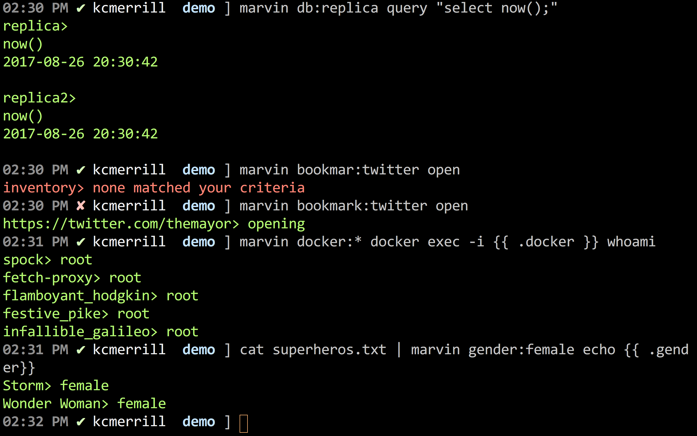

[](https://travis-ci.org/kcmerrill/marvin) [](https://goreportcard.com/report/github.com/kcmerrill/marvin)


# Marvin

An inventory based task runner. Inspired by `xargs`, [Knife](https://docs.chef.io/knife.html) and [Ansible](https://www.ansible.com/). Marvin allows you to define the tasks you want to run, how you want to run them and where depending on how you define and setup your tasks. Create inventory statically by adding them to a centralized config file, or create them dynamically by either piping in inventory through `stdin` or through commands.

[] (https://youtu.be/OPn_1K271Zc)

```bash
# marvin usage
$> marvin <inventory:filter> <taskname> <any additional args you might want to use>
```

Here is an example how you can use marvin to run queries across multiple databases.

```bash
# run a query on all databases in the inventory
$> marvin db:* query "select count(*) from tablename"

# run a query on just the master database
$> marvin db:master query "select count(*) from tablename"

```

The previous commands are made possible given the following `marvin.yml` configuration file.

```yaml
tasks:
  query: |
    mysql -u {{ .user }} -p {{ .password }} -h {{ .host }} -e "{{ .args }} "
inventory:
    dynamic:
      files: ls -R -1
    static: |
      db:master host:master.db.kcmerrill.com user:db_user password:$PASSWORD
      db:replica host:replica.db.kcmerrill.com user:db_user password:$PASSWORD
      db:manual-query host:manual-query.db.kcmerrill.com user:db_user password:$PASSWORD
```

## Built in tasks

By default, there are a few built in tasks. You can overide these if you'd like, but by default you get `ls` and `ssh` as described below.

1. `ls` will show all available inventory, both dynamic and static
1. `ssh` will allow you to run a command with `{{ .args }}` on remote hosts
1. `open` will simply open the file with `open` on macosx
1. Need more? Just add them to `dynamic` section of `inventory` or feel free to pipe it into `stdin`

## Dyanmic Inventory

You can specify commands, that when filtered by, will run commands to generate dynamic inventory. A great example would be, generating ec2 instances inventory on the fly, then running commands on said instances.

```bash
$> marvin : ls #display all available inventory
$> marvin *: ls #display all available inventory
$> marvin *:* ls #display all available inventory

$> marvin env:prod ssh whoami #ssh {{ .host }} {{ .args }}
```

There are some dynamic inventory keys that will be processed when called upon included by default.

1. `file` = `ls -R -1`
1. `dir` = `ls -d */ | cut -f1 -d'/'`
1. `branch` = `git branch | cut -c 3-`
1. `docker` = `docker ps --format "{{ .Names }}"`
1. `bookmarks` = `cat ~/Library/Application\ Support/Google/Chrome/Default/Bookmarks | grep -i http | sed "s/ //g" | sed "s/\"//g" | sed "s/url://g"`

So what does that mean? That means you can run marvin inventory based tasks on said inventory.

Here are a couple of examples:

```bash
$> marvin file:*.go git checkout -- {{ .file }} #reset all .go files in your branch
$> marvin bookmark:console open # this would open via the cli a bookmark of your's in chrome that had console in in(such as AWS console)
```

Again, a bunch of different use cases ... use your imagination.

## Binaries && Installation

Feel free and use `go get` if you already have golang installed. If not, feel free and download a compiled binary just for you and your OS:

[](http://go-dist.kcmerrill.com/kcmerrill/marvin/mac/amd64) [](http://go-dist.kcmerrill.com/kcmerrill/marvin/linux/amd64)
